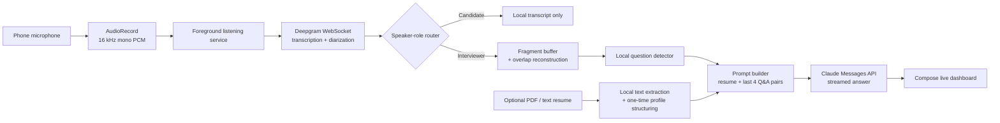

<div align="center">

# Interview Mitra

**A native Android companion for live mock interviews—turning interviewer questions into streamed, resume-aware answer suggestions.**

[](https://developer.android.com/about/versions/oreo)
[](https://kotlinlang.org/)
[](https://developer.android.com/jetpack/compose)

</div>

Interview Mitra is built for open, two-person interview practice on a single Android device. It captures a mixed microphone stream, uses diarized transcription to separate the candidate from the interviewer, detects questions locally, and streams an answer grounded in the candidate’s resume and recent interview context.

## Why it’s useful

- **Fast by design** — audio is captured as 200 ms PCM chunks; question detection is local and the answer appears as Claude streams it.
- **Candidate-safe prompt boundary** — candidate-role transcript chunks remain in the on-screen log and are never included in an answer-generation request.
- **Useful context, bounded cost** — an optional PDF/text resume is condensed once per session, while only the latest four Q&A exchanges are retained for each response.
- **Session-ready Android behavior** — microphone capture runs in a visible foreground service with reconnect handling for the transcription stream.

## Demo

No device screenshots are committed yet. The most useful additions after an on-device test would be:

1. `docs/screenshots/setup.png` — resume upload and answer-style selection.
2. `docs/screenshots/calibration.png` — candidate voice confirmation.
3. `docs/screenshots/live-session.png` — speaker-labelled transcript, current question, and streamed answer.

## How it works



The candidate speaker ID is established during calibration. Any other diarized speaker is treated as the interviewer. When an interviewer utterance settles, the app reconstructs its finalized fragments, applies a lightweight question heuristic, then starts a streamed answer only if a question is detected.

## Tech stack

| Area | Implementation |
| --- | --- |
| App & UI | Kotlin, Jetpack Compose, Android ViewModel |
| Audio | `AudioRecord`, `VOICE_RECOGNITION`, 16 kHz mono PCM16 |
| Streaming | Kotlin Flow, OkHttp WebSocket, Server-Sent Events |
| Speech-to-text | Deepgram live transcription with diarization |
| Answer generation | Anthropic Claude Messages API |
| Resume parsing | PdfBox-Android for PDF; system document picker for files |

## Get running

### Prerequisites

- Android Studio with Android SDK Platform 34 installed
- An Android 8.0+ device or emulator with microphone support
- A [Deepgram API key](https://developers.deepgram.com/) for live diarized transcription
- An [Anthropic API key](https://platform.claude.com/) for resume structuring and suggested answers

### Setup

```powershell
git clone https://github.com/Unseencoderz/Interview-Mitra
cd Interview-Mitra
Copy-Item local.properties.example local.properties
```

Open `local.properties` and replace the example values. Keep this file local—it is ignored by Git.

```properties
sdk.dir=C\:\Users\YOUR_USER\AppData\Local\Android\Sdk
DEEPGRAM_API_KEY=your_deepgram_key
ANTHROPIC_API_KEY=your_anthropic_key
```

Open the project in Android Studio, allow Gradle to sync, select a device, and run the `app` configuration. The project currently does not include a Gradle wrapper, so Android Studio is the supported launch path.

> **No keys?** The setup UI remains available. A Deepgram key is required to complete voice calibration; without an Anthropic key, a detected question displays an explanatory placeholder instead of an answer.

## Use it

1. Optionally upload a PDF or text resume and choose **Concise**, **Detailed**, or **Bullets**.
2. Allow microphone access, then hold the calibration control and speak a short phrase.
3. Once the app confirms your voice, start the live session and place the device where both speakers are audible.
4. Speak naturally. Interviewer questions appear above the streamed suggested answer; use **Stop session** when finished.

## Configuration

| Variable | Required | Purpose |
| --- | :---: | --- |
| `sdk.dir` | Yes | Path to the local Android SDK used by Gradle. |
| `DEEPGRAM_API_KEY` | For live transcription | Authenticates the persistent live transcription WebSocket. |
| `ANTHROPIC_API_KEY` | For AI answers | Structures an uploaded resume and streams suggested answers. |

API keys are compiled from `local.properties` into the local development build via `BuildConfig`. Do not commit `local.properties` or publish builds that contain personal keys.

## Project map

```text
app/src/main/java/com/interviewmitra/
├── MainActivity.kt              # Compose screens and resume picker
├── InterviewViewModel.kt        # Session state and pipeline coordination
├── audio/
│   ├── ListeningService.kt       # Foreground microphone capture
│   └── AudioBus.kt               # Bounded in-memory PCM bridge
├── domain/
│   ├── QuestionDetector.kt       # Local question heuristic and role mapping
│   └── InterviewEngine.kt        # Fragment reconstruction
└── network/
    └── StreamingClients.kt       # Deepgram and Claude clients
```

## Contributing

Issues and pull requests are welcome. Please keep changes focused, never commit API keys, and test microphone behavior on a physical device when touching the audio path.

## License

This project is licensed under the MIT License - see the [LICENSE](LICENSE) file for details.

